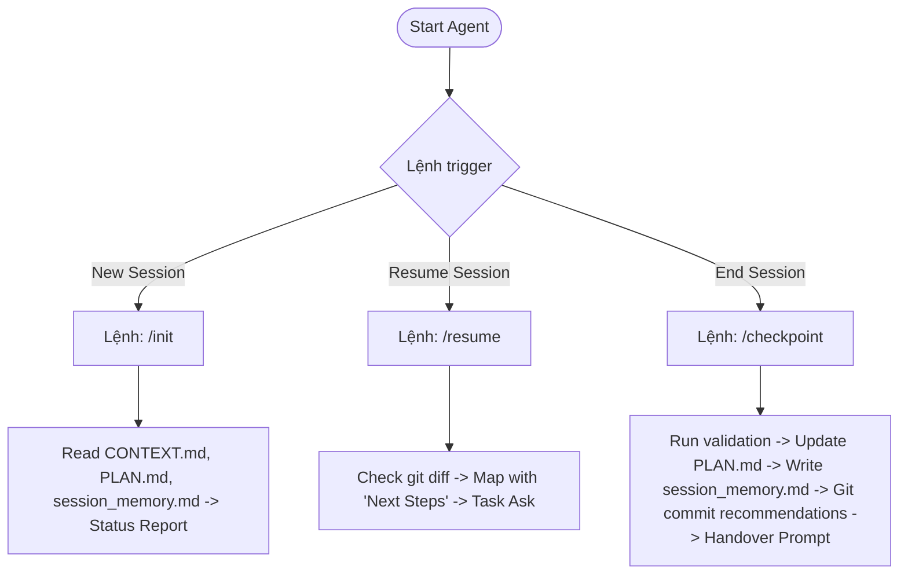

# 🗺️ NovaElectronics Agent Orchestrator & Session Lifecycle Guide
> *Last updated: 2026-07-07 | Path: `.agent/rules/ORCHESTRATOR.md`*

This document coordinates session lifecycle triggers for AI agents working on NovaElectronics.

---

## 🚦 Lifecycle State Machine

---

## 📋 Action Specifications

### 1. When running `/init` (Initialize a new session)
1. Read [CONTEXT.md](file:///r:/_Projects/Eurus_Workspace/dienmay_clone/.agent/rules/CONTEXT.md) to understand structure and targets.
2. Read [PLAN.md](file:///r:/_Projects/Eurus_Workspace/dienmay_clone/.agent/rules/PLAN.md) to understand implementation progress.
3. Read [session_memory.md](file:///r:/_Projects/Eurus_Workspace/dienmay_clone/.agent/workflows/session_memory.md) to check the latest work state and critical pitfalls.
4. **Respond with**: A 3-sentence summary of the current system state, what has been completed, and the active task.

### 2. When running `/resume` (Resume ongoing work)
1. Run `git status` and `git diff` to locate uncommitted changes.
2. Check the `Next Steps` block in [session_memory.md](file:///r:/_Projects/Eurus_Workspace/dienmay_clone/.agent/workflows/session_memory.md).
3. **Respond with**: A summary of uncommitted edits, their context, and ask if the user wishes to continue the last step or select another task.

### 3. When running `/checkpoint` (End of work session)
1. **Verification**: Verify PHP and JS code syntax (e.g. check for PHP warnings, check page loads).
2. **Update PLAN.md**: Mark finished tasks `[x]` and incomplete tasks `[ ]`.
3. **Save Session Memory**: Rewrite [session_memory.md](file:///r:/_Projects/Eurus_Workspace/dienmay_clone/.agent/workflows/session_memory.md) with active tasks done, design decisions, lessons learned (warnings), and the next 3 logical steps.
4. **Git suggestions**: Offer the user a git commit command line representation.
5. **Handover prompt**: Produce a brief copy-pasteable handover block.
